# Distributed Systems Capacity-Aware Job Scheduler

A custom Python client-side job scheduling engine built for distributed system simulations (`ds-sim`). The scheduler optimises task allocation across server clusters by evaluating real-time server availability, resource capacities, dynamic queue lengths, and hardware constraints.

Evaluated against standard baseline algorithms (ATL, FF, BF, FC, FAFC), this algorithm reduced average job turnaround times by **99%+** in high-throughput simulated server workloads.

## Results


### Example scheduling behaviour
 
Generated directly from `ds-sim` simulation logs (`stage2 config 2`) — jobs distributed across `highway`, `offload`, and `silkroad` server instances:

```mermaid
gantt
    title ds-sim Job Scheduling Gantt Chart
    dateFormat X
    axisFormat %s
 
    section highway 0
    Job 0 Waiting: crit, 11, 71
    Job 0: 71, 626
    Job 5 Waiting: crit, 150, 626
    Job 5: 626, 876
    Job 11: 725, 9540
    Job 16: 1050, 1317
    Job 19: 1438, 1730
 
    section highway 1
    Job 2 Waiting: crit, 65, 125
    Job 2: 125, 628
    Job 12: 737, 990
    Job 13: 766, 1213
    Job 17: 1230, 1927
 
    section offload 0
    Job 3 Waiting: crit, 108, 148
    Job 3: 148, 345
    Job 6: 307, 753
    Job 10: 685, 1904
    Job 18: 1357, 1676
 
    section offload 1
    Job 7 Waiting: crit, 414, 454
    Job 7: 454, 542
    Job 9: 616, 2288
 
    section silkroad 0
    Job 1 Waiting: crit, 46, 126
    Job 1: 126, 754
    Job 14: 774, 2407
    Job 15: 782, 2328
 
    section silkroad 1
    Job 4 Waiting: crit, 134, 214
    Job 4: 214, 3832
    Job 8: 470, 1402
```


 
Red bars show jobs waiting for a server to become available; grey bars show active execution. Additional Gantt charts for other test configurations (including larger-scale runs) are available in [`/diagrams`](diagrams).

## Scheduling Algorithm Logic

The engine operates on a capacity-aware fallback strategy:

1. **Available Server Selection:** Query cluster state (`GETS Avail`) for currently idle servers matching job resource profiles.
2. **Multi-Variable Rank Heuristic:** If multiple servers are available, apply a strict deterministic tie-breaking evaluation matrix:
   $$\text{Rank} = (\text{Waiting Jobs}, -\text{Total Cores}, -\text{Avail Cores}, -\text{Avail Memory}, -\text{Avail Disk}, \text{Server ID})$$
3. **Fallback Strategy:** If no idle server matches the request, query capable nodes (`GETS Capable`) and assign tasks to the least-saturated capable server to prevent head-of-line blocking.

## Tech Stack & Simulation Protocol

- **Language:** Python 3
- **Simulation Environment:** `ds-sim` Discrete-Event Distributed Simulator
- **Protocol:** Low-level TCP Socket Communication (Custom ASCII RPC/IPC Interface)
- **Key Metrics Optimized:** Average Turnaround Time, Waiting Time, Cluster Utilization Rate

## IMPORTANT INFO
After creating the codespace, please execute 
```bash
chmod +x ds-*
```
in the terminal. 
You only need to do this for once after the creation of the codespace.

---

## Overview
ds-sim is a discrete-event simulator that has been developed primarily for leveraging scheduling algorithm design. 

It adopts a minimalist design explicitly taking into account modularity in that it uses the client-server model. 

The client-side simulator acts as a job scheduler while the server-side simulator simulates everything else including users (job submissions) and servers (job execution).

---

## Run The Automated Tests
From the repository root in terminal:
```bash
python3 ds_test.py "python3 client.py" -n -p 50000 -c TestConfigs
```

## How to run a simulation:
In one terminal:
```bash
./ds-server -n -p 50000 -v brief -c ./configs/sample-configs/ds-sample-config01.xml
```

In a second terminal:
```bash
python3 client.py
```

The client connects to localhost:50000, performs the required AUTH handshake,
schedules all JOBN and JOBP events, and exits after receiving NONE.

## Algorithm Summary

For each job, the scheduler requests GETS Avail using the job's resource requirements.
If servers are free, it picks the best one using a strict set of rules:

```text
(waiting jobs, -total cores, -available cores, -available memory, -available disk, server id)
```

If no available server is returned, it falls back to GETS Capable and schedules the job to the first capable server returned by ds-server.

